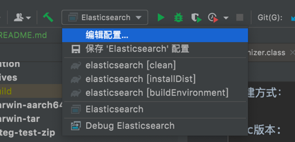
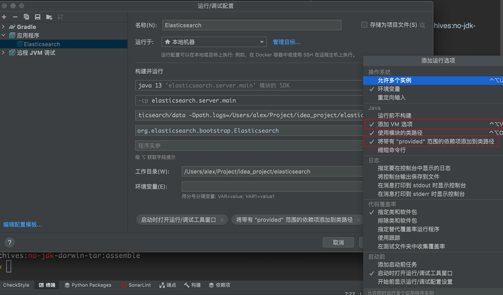
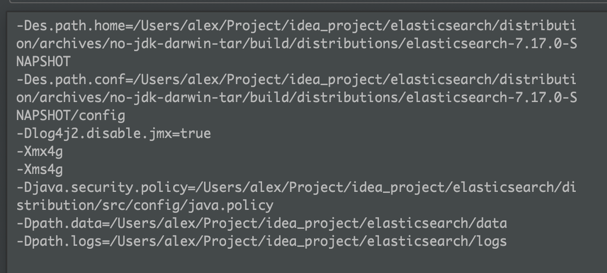

构建方式：

mac版本:

- 执行./gradlew distribution:archives:no-jdk-darwin-tar:assemble，然后看下当前目录的build文件夹，把tar.gz解压
- 在idea启动一下org.elasticsearch.bootstrap.Elasticsearch，一定会报错；按照下面的步骤配置一下
- 
- 
- vm选项，将前缀配置替换成自己的

